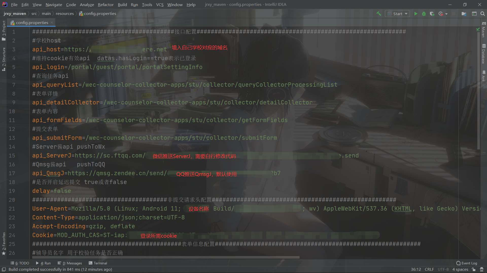
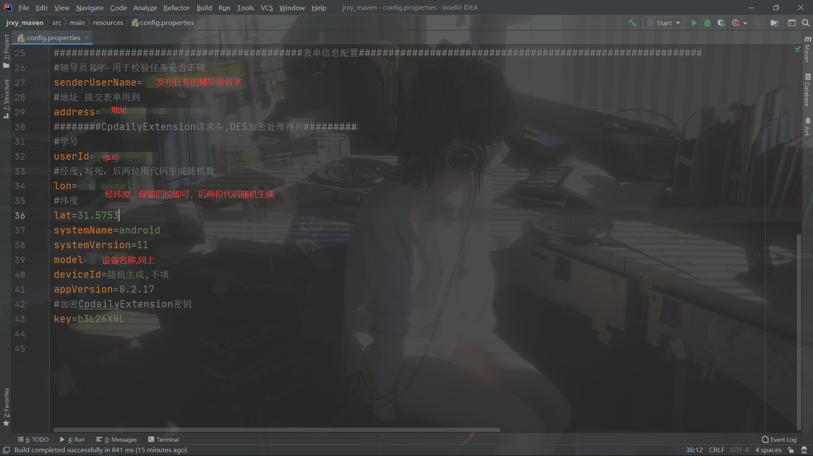
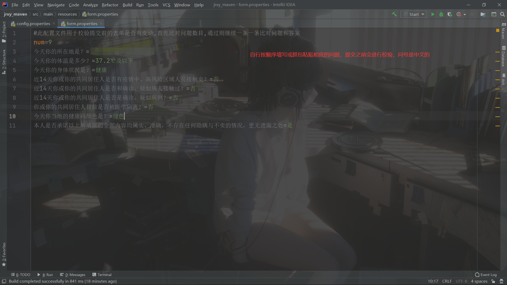
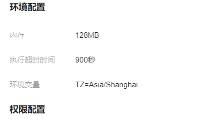
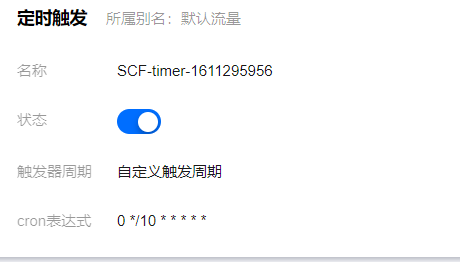

### 站在巨人的肩膀上，参考下面两位大佬的代码，有些拿来直接用了：

https://github.com/ZimoLoveShuang/auto-sign

https://github.com/meethigher/meethigher.github.io/issues/50

安卓7.0抓包fiddler、charles、httpcanary证书安装到系统，软件显示没网，只有在请求的过程中连接小黄鸟才能抓到包，提交和登录那块抓不到

表单做了两次校验，获取任务详情时验证辅导员姓名，提交表单前与form.properties中的配置比对，问题数目有变动或者问题和答案有变动则不会提交，qq推送通知给用户

因为云函数运行有最大时间限制，所以子线程维持cookie没有用了，直接发送请求查询任务，设置云函数每十分钟触发一次，如果任务未发布、任务过期、未提交则不会执行后面代码，只起到维持cookie的作用

# config.properties

# form.properties

# QmsgJ配置

https://qmsg.zendee.cn/me.html 

得到密钥填入

# 腾讯云函数

https://console.cloud.tencent.com/scf/list

已写好入口函数，修改完配置可直接部署，每十分钟触发一次以维持cookie存活，函数设置最大运行时间为900s

